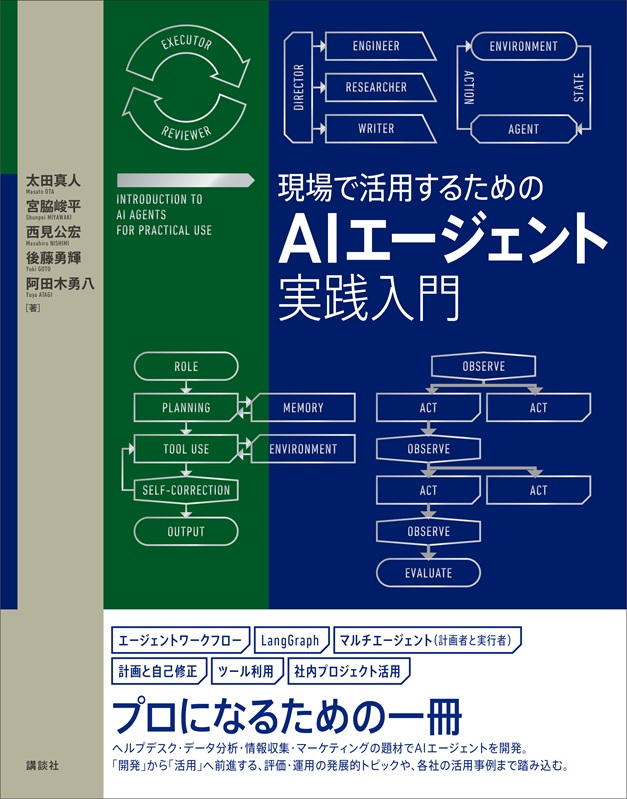

# 「現場で活用するための生成AIエージェント実践入門」リポジトリ

[「現場で活用するための生成AIエージェント実践入門」（講談社サイエンティフィック社）](www.amazon.co.jp/dp/4065401402)のリポジトリです。

本リポジトリでは、書籍のうち実装に関する章を中心に、各章のコードや設定ファイルを提供しています。

## 本リポジトリの使用方法

本リポジトリではVSCodeを使用した実行を想定しています。

各章で独立した管理を行うためにVSCodeのMulti-root workspaces（以降ワークスペース）を活用します。
   
ワークスペースでの作業は以下のいずれかの方法で行います。
- Finderやエクスプローラーで本リポジトリ内の`genai-book.code-workspace`ファイルをダブルクリックしてVSCodeを起動する
- VSCodeのメニューから`ファイル > ファイルでワークスペースを開く`を選択し、`genai-book.code-workspace`ファイルを選択する

各章のコードは、`chapter<章番号>`ディレクトリに格納されており、ワークスペースとして個別に開くことができます。
実行する際はそれぞれの章のREADME.mdを参照し、環境構築や実行方法を確認してください。特に**Pythonの仮想環境はそれぞれの章のワークスペース内に作成することを想定しているのでご注意ください。**

## サポート
- 疑問点や不具合の報告は **GitHub Issues** で受け付けています。不明な点などがございましたら、[issues](https://github.com/masamasa59/genai-agent-advanced-book/issues)をご覧ください。
- 書籍の誤植は、[誤植一覧](https://github.com/masamasa59/genai-agent-advanced-book/issues?q=is%3Aissue%20state%3Aopen%20label%3A%E8%AA%A4%E6%A4%8D)にまとめています。あわせてご参照ください。